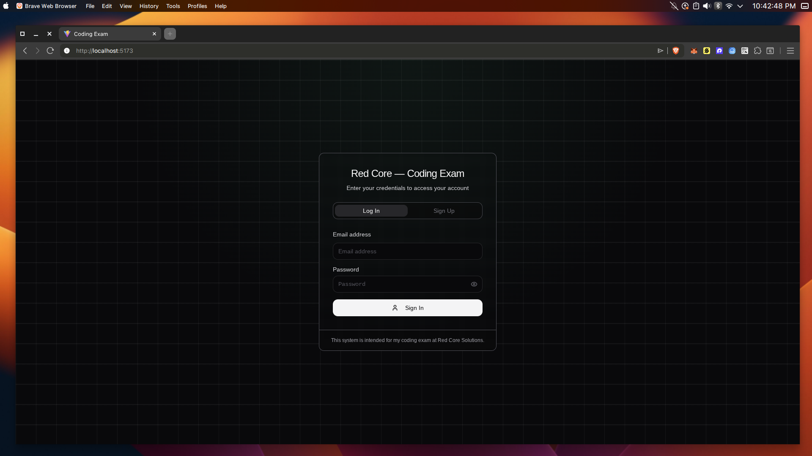
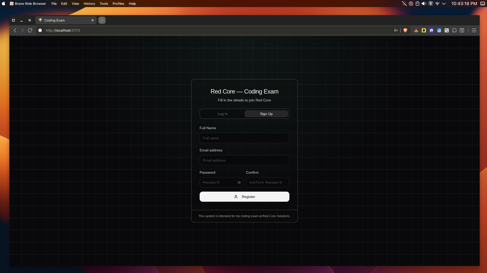
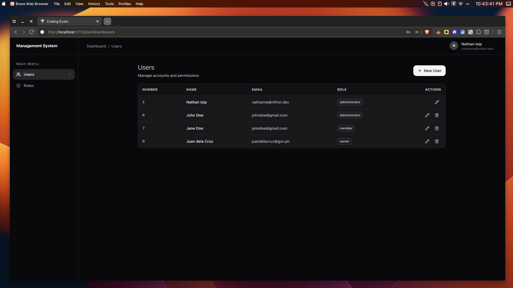
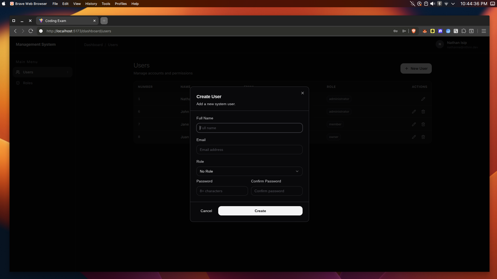
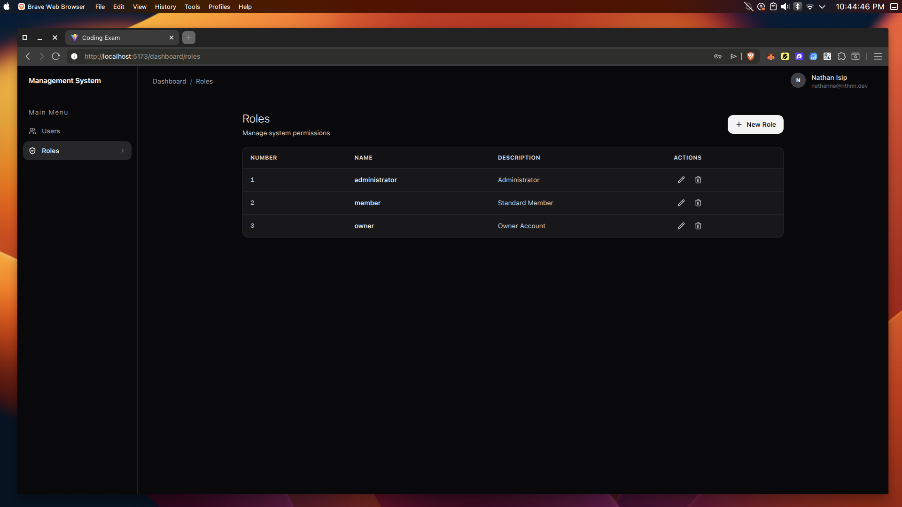
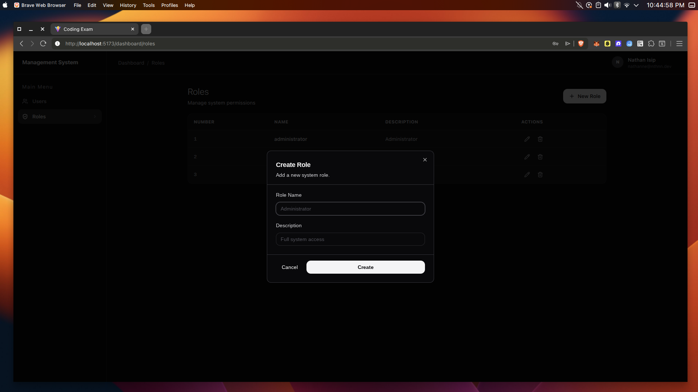
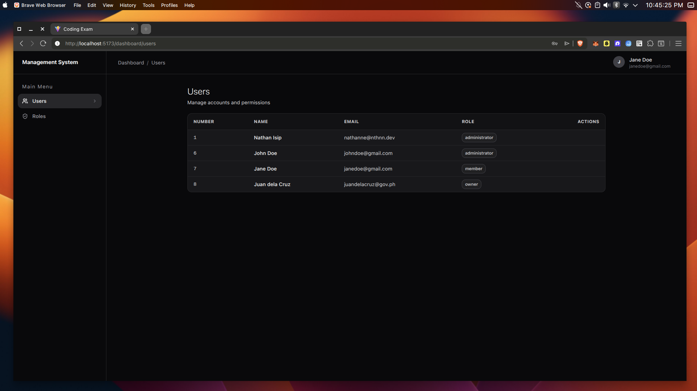
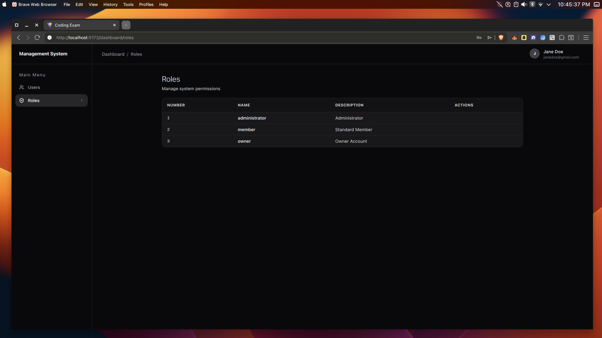

# Coding Exam for RedCore Solutions

A full-stack web application for managing **Users**, **Roles**, and **Permissions**, built with **Laravel** and **ReactJS** for coding exam with Red Core Solutions.

---

## Table of Contents

- [Screenshots](#screenshots)
- [Overview](#overview)
- [Tech Stack](#tech-stack)
- [Prerequisites](#prerequisites)
- [Installation & Setup](#installation--setup)
  - [Automated Setup (Recommended)](#automated-setup-recommended)
- [Running the Application](#running-the-application)
  - [Starting the Backend Server](#starting-the-backend-server)
  - [Starting the Frontend Dev Server](#starting-the-frontend-dev-server)
- [Usage](#usage)
- [API Documentation](#api-documentation)
- [Frontend Pages & Features](#frontend-pages--features)
- [Environment Variables](#environment-variables)
- [Troubleshooting](#troubleshooting)
- [License](#license)

---

## Screenshots

| | |
|---|---|
|  **Login Page** - Fast and secure JWT authentication. |  **Sign Up Page** - New account registration. |
|  **Users Management** - Comprehensive user administration. |  **Create User Modal** - Simple and intuitive user creation. |
|  **Roles Management** - Role-based access control management. |  **Create Role Modal** - Role definition with clear descriptions. |
|  **Users List View** - User list layout for non-admin account. |  **Roles List View** - Clean overview of system roles for non-admin account. |

## Overview

This system provides a secure, role-based user management platform. Administrators can:

- **Authenticate** via JWT-secured login/logout with automatic token refresh.
- **Manage Roles** - Create, view, update, and delete roles with descriptions.
- **Manage Users** - Full CRUD operations on user accounts, each assigned to a role.
- **Dashboard** - A sleek, modern interface with a sidebar navigation layout.

The architecture follows a **decoupled, API-driven** design. The React frontend communicates with the Laravel backend exclusively through RESTful API endpoints, making the system modular and easy to maintain.

---

## Tech Stack

### Backend

| Technology | Version | Purpose |
|---|---|---|
| **PHP** | >= 8.2 | Server-side language |
| **Laravel** | 12.x | PHP web framework |
| **SQLite** | - | Lightweight relational database |
| **JWT Auth** | 2.x (`php-open-source-saver/jwt-auth`) | Stateless authentication |
| **Composer** | Latest | PHP dependency manager |

### Frontend

| Technology | Version | Purpose |
|---|---|---|
| **React** | 19.x | UI component library |
| **TypeScript** | ~5.9 | Type-safe JavaScript |
| **Vite** | 7.x | Lightning-fast build tool & dev server |
| **Tailwind CSS** | 3.x | Utility-first CSS framework |
| **Shadcn UI** | 4.x | Pre-built accessible UI components |
| **React Router** | 7.x | Client-side routing & navigation |
| **Axios** | 1.x | HTTP client for API communication |
| **Framer Motion** | 12.x | Smooth animations & transitions |
| **Lucide React** | - | Beautiful icon library |

---

## Prerequisites

Before setting up the project, ensure the following software is installed on your system:

| Requirement | Minimum Version | Check Command |
|---|---|---|
| **PHP** | 8.2+ | `php -v` |
| **Composer** | Latest | `composer -V` |
| **Node.js** | 18+ (LTS recommended) | `node -v` |
| **npm** | 9+ | `npm -v` |
| **Git** | Latest | `git --version` |
| **SQLite PHP Extension** | - | `php -m \| grep sqlite` |

> **Note:** The `setup.sh` script will attempt to install `curl`, `php-cli`, `php-mbstring`, `git`, and `unzip` via `apt` if they are not already present.

---

## Installation & Setup

### Automated Setup (Recommended)

The project includes a one-command setup script that handles everything - installing dependencies, configuring environment files, generating keys, and preparing the database.

**1. Clone the repository:**

```bash
git clone https://github.com/nthnn/redcoresolutions-exam
cd redcoresolutions-exam
```

**2. Make the setup script executable and run it:**

```bash
chmod +x setup.sh
bash setup.sh
```

**What the setup script does:**

| Step | Action |
|---|---|
| 1 | Installs system packages (`curl`, `php-cli`, `php-mbstring`, `git`, `unzip`) |
| 2 | Copies `.env.example` → `.env` for the backend (if `.env` doesn't exist) |
| 3 | Runs `composer install` to install PHP dependencies |
| 4 | Generates the Laravel application key (`php artisan key:generate`) |
| 5 | Generates the JWT secret key (`php artisan jwt:secret --force`) |
| 6 | Creates the SQLite database file (`database/database.sqlite`) |
| 7 | Runs database migrations (`php artisan migrate --force`) |
| 8 | Installs backend Node.js dependencies (`npm install` in `backend/`) |
| 9 | Copies `.env.example` → `.env` for the frontend (if applicable) |
| 10 | Installs frontend Node.js dependencies (`npm install` in `frontend/`) |

Once setup completes, you will see this message below:

```
[SETUP] Setup complete! Project is ready.
```

---

## Running the Application

After setup is complete, you need to run **two separate servers** - one for the backend API and one for the frontend development server. Each should be started in its own terminal session.

### Starting the Backend Server

Open a **new terminal window/tab** and run:

```bash
cd backend && php artisan serve
```

The backend API will start at:

```
🌐 http://127.0.0.1:8000
```

> **Tip:** Keep this terminal open and running while using the application. All API requests from the frontend are directed to this server.

---

### Starting the Frontend Dev Server

Open **another terminal window/tab** and run:

```bash
npm run dev -- --port 5173
```

> **Important:** Run this command from the `frontend/` directory, or navigate there first with `cd frontend`.

The frontend application will start at:

```
🌐 http://localhost:5173
```

> **Tip:** Vite provides **Hot Module Replacement (HMR)**, so any changes you make to the frontend source code will instantly reflect in the browser even without a full page reload.

---

### Quick Start Summary

| Terminal | Directory | Command | URL |
|---|---|---|---|
| **Terminal 1** | `backend/` | `php artisan serve` | `http://127.0.0.1:8000` |
| **Terminal 2** | `frontend/` | `npm run dev -- --port 5173` | `http://localhost:5173` |

---

## Usage

1. **Open** your browser and navigate to **`http://localhost:5173`**.
2. **Log in** with valid credentials through the login page.
3. Once authenticated, you will be redirected to the **Dashboard**.
4. Use the **sidebar navigation** to switch between:
   - **Home** - Dashboard overview
   - **Users** - Manage user accounts (create, edit, delete, assign roles)
   - **Roles** - Manage roles (create, edit, delete)
5. **Log out** when finished to invalidate your session token.

---

## API Documentation

For complete and detailed API endpoint documentation - including request/response schemas, authentication requirements, error handling, and database schema - please refer to:

### [`backend/README.md`](backend/README.md)

The backend documentation covers all available endpoints:

| Category | Endpoints |
|---|---|
| **Authentication** | `POST /api/login`, `GET /api/me`, `POST /api/logout`, `POST /api/refresh` |
| **Roles** | `GET /api/roles`, `POST /api/roles`, `GET /api/roles/{id}`, `PUT /api/roles/{id}`, `DELETE /api/roles/{id}` |
| **Users** | `GET /api/users`, `POST /api/users`, `GET /api/users/{id}`, `PUT /api/users/{id}`, `DELETE /api/users/{id}` |

> All protected routes require a valid JWT token passed in the `Authorization: Bearer <token>` header.

---

## Frontend Pages & Features

| Page | Route | Description |
|---|---|---|
| **Login** | `/` | JWT-authenticated login with email & password |
| **Dashboard / Home** | `/home` | Main dashboard overview page |
| **Users Management** | `/users` | Full CRUD table for managing user accounts |
| **Roles Management** | `/roles` | Full CRUD table for managing user roles |

---

## Environment Variables

### Backend (`backend/.env`)

| Variable | Description | Default |
|---|---|---|
| `APP_KEY` | Laravel application encryption key | Auto-generated |
| `DB_CONNECTION` | Database driver | `sqlite` |
| `JWT_SECRET` | Secret key for signing JWT tokens | Auto-generated |

### Frontend (`frontend/.env`)

| Variable | Description | Default |
|---|---|---|
| `VITE_API_URL` | Backend API base URL | `http://127.0.0.1:8000/api` |

> **Note:** The `.env` files are created automatically by `setup.sh` from their respective `.env.example` templates. Do not commit `.env` files to version control.

---

## Troubleshooting

### Common Issues

<details>
<summary><strong>❌ "php: command not found"</strong></summary>

PHP is not installed or not in your system PATH. Install it with:

```bash
sudo apt install php-cli php-mbstring php-sqlite3
```

</details>

<details>
<summary><strong>❌ "composer: command not found"</strong></summary>

Install Composer globally or use the included `composer.phar`:

```bash
# Use the included composer.phar
php composer.phar install

# Or install Composer globally
curl -sS https://getcomposer.org/installer | php
sudo mv composer.phar /usr/local/bin/composer
```

</details>

<details>
<summary><strong>❌ SQLite driver not found</strong></summary>

Install the PHP SQLite extension:

```bash
sudo apt install php-sqlite3
```

</details>

<details>
<summary><strong>❌ Frontend can't connect to the backend API</strong></summary>

1. Ensure the backend server is **running** on `http://127.0.0.1:8000`.
2. Check that `VITE_API_URL` in `frontend/.env` points to the correct backend URL.
3. Verify there are no CORS issues - Laravel is configured to allow cross-origin requests from the frontend.

</details>

<details>
<summary><strong>❌ Port 5173 is already in use</strong></summary>

Either stop the process using that port or use a different port:

```bash
npm run dev -- --port 5174
```

</details>

<details>
<summary><strong>❌ JWT token expired or unauthorized errors</strong></summary>

1. Ensure you have generated the JWT secret: `php artisan jwt:secret`
2. Try logging out and logging back in to get a fresh token.
3. The token expires after a period of inactivity - the app will attempt to auto-refresh the token.

</details>

---

<div align="center">
DISCLAIMER: This project is intended and has been built solely for the purpose of my application with Red Core Solutions.
</div>
